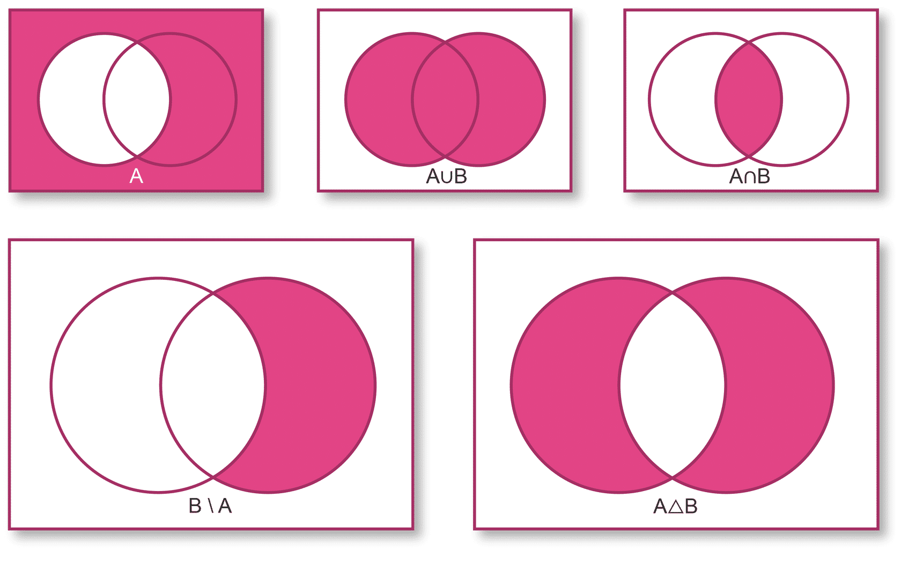
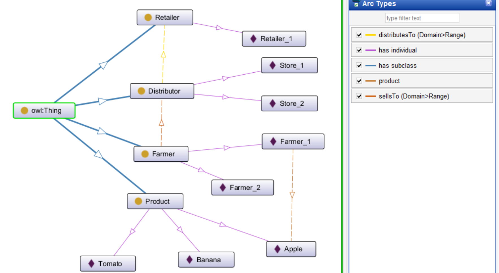
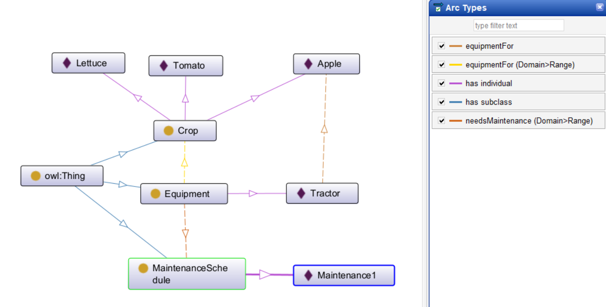
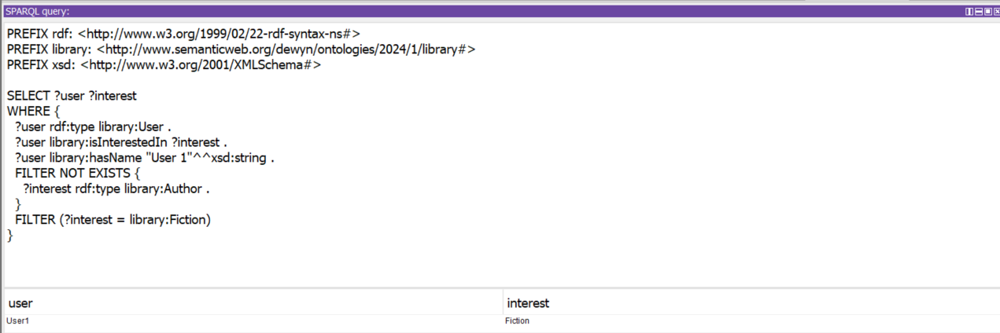

# Knowledge Representation and Reasoning

## Learning Outcomes

1. Critique the need for formal approaches to knowledge representation and reasoning.
2. Review critically properties of a knowledge-based system.
3. Appraise critically modelling techniques for knowledge representation and reasoning.
4. Examine and incorporate different modelling approaches to solving KRR problems.

---

KRR is a fascinating subfield of Artificial Intelligence (AI) that delves into the very essence of "thinking" for machines. It's about how information about the world can be encoded in a way that computers can understand and utilize to solve complex problems.

Knowledge Representation it's like creating a dictionary for computers. KRR devises formal languages and structures to capture facts, relationships, and concepts about the world. From simple rules to intricate ontologies, the goal is to build a knowledge base that computers can understand.

## Knowledge Representation: A Historical Analysis and Its Relationship with Reasoning (Discussion Forum)

As we were introduced into the realm of knowledge representation and reasoning (KRR), we started a conversation on whether or not KRR is a recent phenomenon and if it only became a topic of discussion with the development of computing technology and the need to represent knowledge in computer systems.

The discussion forum revolves around the historical significance and evolution of Knowledge Representation (KR). The initial post provides a concise overview, tracing KR's journey from ancient civilizations like Sumeria and Egypt to its contemporary applications in AI and knowledge graphs. You emphasize the enduring human drive to understand and represent knowledge, regardless of advanced reasoning capabilities.

Maria's insightful response effectively reinforced the value of structured knowledge beyond reasoning with the indigenous petroglyph example. Their personal experience with OWL grounded the discussion in concrete terms and prompted a deeper exploration of reasoning through the intriguing example of Egyptian hieroglyphics and their deciphering process. While their observation of the "lost knowledge" period sparked my curiosity, exploring the socio-cultural context could enrich my understanding.

This collaborative interaction has highlighted the multifaceted nature of Knowledge Representation, prompting me to delve deeper into the intricate interplay between representation and reasoning. I invite further exploration of this captivating topic, where questions and contributions from diverse perspectives can illuminate new avenues of knowledge.

[Discussion Forum](https://www.my-course.co.uk/mod/forum/discuss.php?d=203597)

[Summary Post](https://www.my-course.co.uk/mod/forum/discuss.php?d=212629)

### Reference

Ancient civilizations and knowledge representation: Brachman, R. J., & Levesque, H. J. (1985). Knowledge representation in five paradigms. AI Magazine, 1(4), 10-30.

Medieval logicians and formal languages: Guarino, N. (1998). Formal ontology in information systems. In N. Guarino (Ed.), Formal ontology in information systems (pp. 3-18). Springer.

AI and expert systems: Russell, S. J., & Norvig, P. (2016). Artificial intelligence: A modern approach. Pearson Education.

Knowledge sharing and discovery: Staab, S., & Studer, R. (Eds.). (2004). Handbook of ontologies (2nd ed.). Springer

Cruz-Uribe, E. (2010) The Death of Demotic Redux\*: Pilgrimage, Nubia and the Preservation of Egyptian Culture.

DeBellis, M. (2021) A Practical Guide to Building OWL Ontologies Using Protégé 5.5 and Plugins. Available from: https://www.researchgate.net/publication/351037551_A_Practical_Guide_to_Building_OWL_Ontologies_Using_Protege_55_and_Plugins [Accessed 15 December 2023].

Loprieno, A. and Müller, M. (2012) Ancient Egyptian and Coptic, in The Afroasiatic Languages. Cambridge University Press 102–144.

Malik, N., Hijam, D. & Sharan, A. (2021) Ontology based knowledge representation: Case study from agriculture domain, International Journal of Knowledge-Based and Intelligent Engineering Systems 25(1): 97–108. DOI: https://doi.org/10.3233/KES-210055.

## Data & Information

In the realm of knowledge representation and reasoning, the distinction between data and information is crucial. While often used interchangeably, they carry distinct roles:

- **Data**: The raw, unprocessed material forming the foundation. Think of it as individual bricks, numbers, symbols, or characters awaiting meaning. Data may be stored and transmitted within systems but holds no inherent significance on its own.

- **Information**: The processed and contextualized understanding derived from data. Imagine the bricks arranged into a complex structure, forming a meaningful picture. Information emerges from applying operations, analysis, and interpretation to data, giving it context and relevance.

## Knowledge Representation

In the world of Knowledge Representation and Reasoning (KRR), understanding the interplay between knowledge and its representation is fundamental.

- **Knowledge**: This isn't simply information. It's the deeper understanding derived from processing and integrating information. It's the "how" and "why" behind the "what," the connections and insights gleaned from data. Imagine data as scattered pieces, information as organized blocks, and knowledge as the completed edifice - a structure with purpose and meaning.

- **Representation**: This involves expressing knowledge in a form computers can understand and manipulate. It's like choosing the best language to convey a complex idea. We might use logic statements, graphs, or even visual symbols, depending on the specific knowledge and reasoning tasks at hand.

Knowledge representation (KR) is the art of capturing and expressing knowledge in a way computers can understand. Imagine it as building a bridge between the human mind and the digital world.

## Reasoning

The course text offers a technical definition of reasoning as the manipulation of symbols representing propositions to arrive at new ones. Reasoning sits at the heart of Artificial Intelligence (AI). The very question of "Can machines think?" posed by pioneers like Turing and McCarthy hinged on whether machines could reason like humans.

Graham-Lengrand offers a more succinct perspective: reasoning is "the art of establishing truth." This resonates with the idea of using logic and knowledge to uncover deeper understandings.

By understanding these varied perspectives, we gain a richer appreciation of reasoning's role. It's not just about manipulating symbols, but about the profound ability to use logic and knowledge to draw conclusions, establish truth, and ultimately, approach the elusive concept of "thinking" machines.

## Why do we need KRR?

Internal Efficiency: Complex systems, like AI algorithms, operate based on internal representations of knowledge (symbolic structures, algorithms, etc.). KRR provides essential tools and frameworks for building these internal representations in a way that efficiently generates intelligent behavior. These representations act as the hidden drivers of the system's actions, analogous to the chess-playing computer whose moves "appear" driven by intentions like protecting the queen, but are actually driven by underlying algorithms interacting with its knowledge base.

Also, we often need to understand and interact with complex systems like AI. KRR allows us to interpret their behavior not by understanding the nitty-gritty details of their internal workings, but by analyzing the outcomes and attributing them to intentional states like beliefs and desires. This "intentional stance" helps us bridge the gap between the system's internal representation and its output, making it easier to interact with and predict its behavior.

Therefore, KRR plays a dual role: within the system, it provides efficient knowledge structures for intelligent behavior, and outside the system, it helps humans understand and interact with those intelligent systems.

### References

Dennett, D. C. (1971). "Intentional systems in cognitive science". Brain Research, 15(1): 173-202.

Bostrom, N. (2008). "What is artificial intelligence?". In: Black, J. (ed.), Philosophy of mind: A guide for the twenty-first century. Oxford University Press.

## Ontologies

Ontologies play a crucial role as "specifications of conceptualizations." This means they formalize how specific domains understand and categorize concepts, relationships, and entities. Historically, the term derived from philosophy, reflecting on the nature of existence and being. However, AI research pioneered by McCarthy (1987) repurposed it as a tool for constructing knowledge models within computer systems. Today, ontologies find diverse applications in KRR, ranging from medical systems and research to the Semantic Web.

Their role in the Semantic Web is particularly noteworthy. This ambitious project envisions an interconnected web of knowledge, where machines can understand and reason with information represented in a standardized way. Ontologies become essential here, providing the shared vocabulary and structure for machines to interpret and utilize knowledge across different domains and sources. In essence, they act as the bridge between data and meaningful understanding, enabling the true potential of intelligent systems to reason and solve problems effectively.

### References

McCarthy, J. (1987). "Circumscription: An artificial intelligence approach to formal reasoning". Artificial Intelligence, 30(1-2), 87-129.

## Set Theory

Set theory is a branch of mathematics that deals with the properties of collections of objects, called sets. Sets are often represented by Venn diagrams, which are pictures that show the relationships between different sets.

Set theory is a powerful tool that can be used to solve a wide variety of problems in mathematics, logic, and computer science. It is an essential part of the foundation of modern mathematics.

## ZFC Axioms

Set theory, once plagued by paradoxes, found stability through axioms, focusing on relationships and properties over the nature of sets. These axioms ensure consistency, plausibility, and resemblance to the intuitive "naive" set theory.

**Key Axioms**:

- Extensionality: Sets are defined by their members; sets with identical members are equal.
- Empty Set: There exists a set with no members, called the null set.
- Separation: For any set and property, a new set exists containing only members with that property.
- Pairing: Given any two sets A and B, a new set {A, B} containing only them exists.
- Union: Every set A has a union set (UA) containing all members of its member sets.
- Power Set: Every set A has a power set P(A) containing all its subsets.
- Infinity: There exists an infinite set.
- Replacement: For any definable function F(x, y) in set A, there's a set B containing all its function values.
- Choice: For any collection of non-empty, disjoint sets, there exists a set containing exactly one element from each. (This is the most controversial axiom.)
- These axioms form the foundation of modern set theory, ensuring a robust and consistent framework for studying sets and their relationships.

## Truth Tables

Truth tables are tools used to analyze and evaluate logic statements. Developed in 1881 by Christine Ladd and popularized by Wittgenstein, they offer a clear way to examine how logical operations like AND, OR, XOR, XNOR, and conditionals behave under different truth values.

Each statement (proposition) is assigned a truth value (True or False).
All possible combinations of truth values for the statements are listed.
Each logical operation is applied to each combination, resulting in a final truth value.
Benefits:

**Evaluate truth**: Determine the truth value of complex logic statements based on individual propositions.

**Identify patterns**: Understand how different logical operations interact with various truth combinations.

**Simplify expressions**: Rewrite complex statements into equivalent, easier-to-understand forms.
Example:

Imagine statements P and Q:

- P: The sun is shining.

- Q: It is raining.

A truth table can show how "**P AND Q**" (it is both sunny and raining) evaluates differently across various scenarios:
| P | Q | P AND Q |
|---|---|---|
| True | True | True |
| True | False | False |
| False | True | False |
| False | False | False |

This helps clarify that "**P AND Q**" is only true when both **P** and **Q** are true.

Truth tables offer a clear and systematic way to analyze and understand logical statements, making them valuable tools in various fields like mathematics, computer science, and philosophy.

## Propositional Logic

Propositional logic, also known as sentential logic, analyzes how to combine and manipulate statements (propositions) to form more complex ones. It explores the logic behind these combinations and the resulting properties.

Working with symbols (P, Q, etc.) like in math is often easier than handling lengthy statements themselves.

**Key Operators**:

- **AND**: Both statements must be true for the overall statement to be true.
- **OR**: At least one statement must be true for the overall statement to be true.
- **NOT**: Reverses the truth value of a statement.

Rules of Inference:

- **Modus Ponens**: If P implies Q, and P is true, then Q is true.
- **Modus Tollens**: If P implies Q, and Q is false, then P is false.

## FOL & Logic Quantifiers

Propositional logic lays the foundation, but First-Order Logic (FOL) opens up new possibilities for representing and reasoning about the world. It goes beyond basic statements (propositions) to consider relationships and properties of objects.

**Key Differences:**

**Atomic Formulas**: While propositions are indivisible units, FOL allows atomic formulas expressing relationships. Imagine a simple statement like "It rained yesterday." In FOL, we could represent this as Rain(Yesterday), showing the relation "Rain" holds for the object "Yesterday".

**Variables and Quantification**: FOL introduces variables, making statements more general. Instead of saying "Rain(Monday)", we could use Rain(X) where X represents any day of the week. This allows quantification:

- **Universal Quantifier (∀)**: "For all" instances. Like: ∀X Rain(X) meaning it rains on every day.
- **Existential Quantifier (∃)**: "There exists" some instance. Like: ∃X Rain(X) meaning it rains on at least one day.

**Example:**

Imagine a rule: "Students must pass all exams to graduate."

- Propositional logic: "John passed all exams" (True/False for John)
- FOL: Graduate(Student) ⇔ ∀Exam Passed(Student, Exam) This states a student graduates only if they pass all exa (∀Exam).

**Benefits of FOL:**

- Expresses complex relationships and rules.
- Handles variables for generality and flexibility.
- Enables reasoning and proof systems for drawing conclusions.

## Semantic Nets

Semantic nets are graphical structures like mind maps, used to represent knowledge as interconnected nodes (concepts) and arcs (relationships). They were first explored by Quillian (1968) and find applications in various fields.

**Advantages:**

1. **Easy inheritance**: Semantic nets naturally depict inheritance relationships between concepts, making them intuitive for representing taxonomic hierarchies like "cat is a mammal."
2. **Visual appeal**: The graphical layout provides a clear visual representation of connections, aiding human understanding and knowledge organization.

**Limitations:**

- **Precision**: Compared to logic-based representations (like predicate logic), semantic nets offer less precision in expressing complex relationship.
- **Multiple inheritance**: Representing concepts with multiple parents can be cumbersome in traditional semantic nets due to their focus on binary relationships.

## Frames

Developed by Minsky in 1975, frames offer a knowledge representation method similar to the familiar object-oriented programming paradigm. They serve as an alternative to semantic nets and predicate logic.

**Structure**:

- Frames represent entities (objects, situations) using a slot-value structure.
- Slots are like properties, holding specific information (values) about the entity.

**Key Features:**

- **Defaults**: Slots can have default values, which can be overridden with new information. Example: A car's default status might be "OK," but it changes to "Broken" if a flat tire is discovered.
- **Inheritance**: Frames can inherit properties and values from other related frames.
- **Reasoning**: Associated languages like KRL and KL-ONE enable inferences and reasoning based on frame knowledge.

**Advantages**:

- **Natural representation**: Frames offer a way to organize knowledge in a way that aligns with how humans perceive and reason about the world.
- **Flexibility**: Default values and inheritance make frames adaptable to different situations and contexts.
- **Reasoning capabilities**: Associated languages allow inferencing and drawing conclusions based on frame relationships.

**Limitations**:

- **Complexity**: Designing and managing complex frame systems can be challenging.
- **Efficiency**: Implementing frames using traditional methods can be less efficient than other representations.

## Horn Clauses

Horn clauses are a specific type of formula in First-Order Logic (FOL) with unique properties that make them valuable in logic programming languages like Prolog. They contribute to efficient theorem proving and offer a concise way to represent knowledge.

**Key Characteristics**:

Single positive literal: Each clause contains at most one literal without negation (a positive statement).
Disjunctive form: A clause expresses an "OR" combination of literals (statements).
Facts and Rules: Clauses can represent facts (known truths) or rules with conditions leading to a conclusion.
Example:

P ← Q ∧ R (read as: P is true if Q and R are true)

R ← U ∨ V (read as: R is true if U or V is true)

Q and V are facts (assumed true).

**Benefits**:

Efficiency: Horn clauses enable efficient automated theorem proving due to their simple structure and properties.
Expressiveness: They can represent both facts and rules, making them versatile for knowledge representation.
Programming applications: Languages like Prolog rely on Horn clauses to define logic programs and reason about knowledge.

**Converting statements**

Equations can be transformed into Horn clauses (e.g., "maternal-grandmother(X) = mother(mother(X))" becomes a rule).
Quantifiers can be adjusted to fit the Horn clause format.

**Types of Horn clauses:**

- **Positive/Definite**: Contains one positive literal (e.g., P ← Q ∧ R).
- **Negative**: No positive literals (all negated) or no literals at all (rare).

## Features of Logic Programming Languages

First proposed in the 1950s, differ from numeric manipulation languages like Fortran and data processing languages like COBOL by specializing in symbolic manipulation. This means they focus on processing symbols, logic, and relationships rather than just numbers.

Several key features characterize good logic programming languages:

1. **Support for Symbolic Computation**: They handle various data structures like Horn clauses, lists, and sets, enabling symbolic reasoning.
2. **Flexible Control:** Features like pattern matching, dynamic rule execution, message passing, and dynamic binding allow for flexible problem-solving approaches.
3. **Alternative Programming Methods:** They excel at solving complex AI problems that may lack complete specifications initially, often utilizing domain-specific approaches and heuristics.

4. **Modularity and Extensibility**: Modular code with localized scope and clear boundaries (functions, recursion) enhances maintainability and allows for easier extensibility through techniques like pattern matching and domain-specific languages.
5. **Dynamic Binding and Constraint Propagation**: Variables can be bound during program execution, enabling constraint propagation and flexible reasoning.
6. **Clear and Well-Defined Semantics**: Many logic programming languages are based on well-defined mathematical principles like predicate logic, leading to clear semantics and suitability for knowledge representation, correctness proofs, and automated code generation.

These features make logic programming languages powerful tools for symbolic reasoning, problem-solving, and knowledge representation, particularly in domains like artificial intelligence.

## Modeling

Modeling is a tool to abstract, represent, and understand complex real-world systems. It involves creating a simpler version of reality focused on specific aspects while ignoring irrelevant details.

Purposes of Modeling:

- Reduction of complexity: Make difficult systems easier to understand and analyze.
- Simulation: Experiment with systems in ways not possible in reality.
- Conceptualization: Formalize and clarify our understanding of complex concepts.
- Derivation: Identify trends and patterns in data, predict future outcomes.

**Modeling Process:**

- **Observe and measure**: Study the real-world system, gather data on its behavior.
- **Theorize**: Develop a model based on the observations and understanding.
- **Compare and refine**: Run the model alongside the real system, compare outputs, and update the model based on discrepancies.

**Benefits of Modeling:**'

- **Improved understanding**: Simplifies complexity, enabling deeper analysis.
- **Simulation and prediction**: Allows experimentation and testing under controlled conditions.
- **Knowledge representation**: Provides a formal structure for knowledge sharing and reasoning.

## Types of Knowledge Models

- **Diagnostic models**: Assist in diagnosis (e.g., medical diagnosis, equipment fault finding).
- **Explorative models**: Analyze geological structures for resource exploration.
- **Selective models**: Recommend products based on user data (e.g., e-commerce).
- **Analytic models**: Evaluate options based on criteria (e.g., semantic web agents).
- **Instructive models**: Train users through feedback loops (e.g., variations of expert systems).
- **Constructive models**: Machine learning systems learning based on data feedback.
- **Hybrid models**: Combine multiple types for self-learning and adaptable solutions.

## Knowledge Acquisition

Scientific method is implemented: Observation, research, hypothesis, testing, analysis, reporting. Applicable to various domains for modelling, problem-solving, and verification.

**Modelling Technology and Techniques:**

- **Choice depends on desired outcome**: abstraction, simulation, conceptualization, derivation, or proof.

- **Formal languages (Z notation)**: Mathematical proofs via logic formulas.

- **Programming languages**: Simulation of complex systems.

- **Ontologies and Semantic Web (OWL, SWRL)**: Conceptual models.
- **Probabilistic and statistical techniques (Monte Carlo simulations, Bayesian methods)**: Extract trends from data, predict future behavior.

## RDF, Ontologies, and Knowledge Modelling

- **Ontologies**: Define concepts and relationships for conceptual models.
- **RDF**: Describes resources using URLs/URIs for unique identification.
  Ontologies created with tools like Protégé, supported by existing ontologies like WordNet and DBpedia.

## Semantic Web, Ontologies, and SWRL

- Ontologies combined with Semantic Web for intelligent agents.
- Agents use logic expressions (FOL, OWL-DL, SWRL) for information retrieval and reasoning.
- SWRL combines OWL-DL with horn clauses for logic statements and expressions.
- Used in web brokering systems for intelligent agents' negotiations.

## Statistical and Probabilistic Modelling

- **Abductive reasoning**: Inferring P from "if P implies Q and Q is true".
- **Monte Carlo Simulation (MCS)**: Generates random inputs, performs calculations, aggregates results for analysis.
- **Bayes Theorem: Calculates probability of event A given event B (conditional **probability). Useful for real-world applications.

# Knowledge Elicitation and Formalism

Our understanding of the world progresses through three distinct stages: data, information, and knowledge. Data acts as the foundation, consisting of raw, unprocessed facts like "the temperature outside is 5 degrees Celsius." Adding context and interpretation transforms this data into information. In our example, understanding this temperature as "cold" creates meaningful information. Finally, we move to knowledge when we utilize this information to draw conclusions and take action. Recognizing "cold" and choosing warm clothes demonstrates the application of knowledge. As Debenham stated, "knowledge is the explicit functional associations between items of information and/or data." This highlights the crucial role of meaningful connections in transforming raw data into actionable understanding.

## Types of Knowledge

The realm of knowledge engineers encompasses three key types:

- **Declarative Knowledge**: This factual cornerstone deals with "what is," holding statements like "a light bulb needs electricity to glow."
- **Procedural Knowledge**: It builds upon factual foundations, providing "how to" approaches based on those facts. It guides actions, like the individual who checks water before boiling, adding it if insufficient.
- **Meta-Knowledge**: This type goes beyond, asking "what do I know about what I know?" It helps understand how experts leverage knowledge, such as preferring planes or trains for long journeys compared to footpaths or bicycles for shorter trips.

## Knowledge Engineering

Transforming human knowledge into usable computer systems requires a structured approach. Knowledge engineering outlines five key steps:

1. **Knowledge Acquisition**: Gathering knowledge from diverse sources like experts, documents, databases, and even the internet.
2. **Knowledge Validation**: Ensuring the acquired knowledge is accurate and relevant, often through testing and verification.
3. **Knowledge Representation**: Structuring the knowledge into a form understandable by the computer, like building a map of concepts and relationships.
4. **Knowledge Reasoning**: Enabling the system to use the knowledge for decision-making or providing advice by drawing inferences and making connections.
5. **Explanation**: Increasingly important, this step allows the system to explain its reasoning and conclusions, offering transparency and building trust with users.

## Knowledge Acquisition: Sources

Building a smart system starts with acquiring knowledge from various sources. This text highlights several valuable resources:

- Procedure Manuals: Step-by-step instructions and detailed descriptions found in user manuals offer insights into business processes.
- Past Case Studies: These provide valuable data, information, and knowledge along with practical applications for actionable decisions.
- Standards Documentation: Established standards and documentation offer reliable knowledge about specific systems and procedures.
- Human Expertise: Experts, non-experts, and even various actors within a system can contribute valuable knowledge for building a KBS.
- Expert Systems: For systems designed to mimic human experts, knowledge acquisition heavily relies on extracting knowledge from those experts through discussions and interactions.

## Knowledge Acquisition: Techniques

Building a knowledge-based system involves capturing valuable information from various sources. This text focuses on several key techniques:

1. **Interviews**:
   - **Structured Interviews**: Standardized approach with pre-defined questions, ensuring consistency and ease of analysis across interviewees.
   - **Unstructured Interviews**: Open-ended discussions allowing for flexible exploration of knowledge, but potentially missing key details.
   - **Thinking Out Loud/Event Recall**: Encourages reflection on past experiences and solutions, but might not comprehensively cover all relevant aspects.
2. **Questionnaires**: Structured sets of pre-defined questions distributed to targeted individuals for efficient data collection.
3. **Repertory Grid Technique**: Explores personal and interpersonal meaning systems, particularly useful in clinical domains.
4. **Observation**: Critically observing system actors in action to understand their processes and interactions, providing direct insights into their knowledge and behavior.

# Formalism

Once we've gathered valuable knowledge, the next step is to structure it in a way that allows computers to understand and utilize it. This critical process, known as formalization, aims to represent the acquired knowledge within a Knowledge-Based System (KBS) efficiently and effectively.

## The Five Roles of Knowledge Representation

Understanding how knowledge is represented in intelligent systems is crucial. This text by Davis et al. (1993) highlights five key roles that knowledge representation plays:

1. **Surrogate**: Representing things in the world inside a system, raising questions about identity and accuracy. Perfect representation is impossible, but we strive for close enough to avoid misleading inferences.

2. **Ontological Commitment**: Choosing a perspective on the world by selecting an ontology. Each choice shapes how the system sees and reasons about the task at hand, requiring careful consideration of what entities and relationships matter most.

3. **Fragmentary Theory of Reasoning**: Reflecting insights about intelligent reasoning, but only partially. KR captures some aspects of how humans think, but acknowledges the full picture is much more complex.

4. **Efficient Computation**: Balancing representation power with computational feasibility. Building fast systems is important, but not at the expense of sacrificing the ability to represent and reason about the world effectively.

5. **Human Expression**: Facilitating communication with machines and other people. KR acts as a shared language for expressing knowledge, enabling information exchange and understanding.

These roles often have conflicting demands, but keeping them all in mind helps us design more effective KR systems. By understanding these different perspectives, we can make better choices about how to represent knowledge and build intelligent systems that are accurate, efficient, and understandable.

## Formalism: The Process

Formalizing knowledge, the process of structuring it for computers to understand, involves a journey in four key steps:

1. **Scoping**: This initial stage sets the stage. It defines the specific task at hand and the desired outcome of the knowledge representation process. What problem are we trying to solve? What knowledge do we need to capture to achieve that goal? Defining these boundaries ensures we gather and structure the right information.

2. **Pre-representation**: Now, we dive into the domain itself. This step involves collecting relevant terms and organizing them into a set of core concepts. Think of it like gathering ingredients for a recipe. By identifying key terms and establishing connections between them, we start building the foundation for representing knowledge effectively.

3. **Post-representation**: We've gathered the ingredients, now it's time to prepare them. This phase involves refining the collected terms. Normalization ensures consistency and reduces ambiguity. Identifying hierarchies and relationships among them establishes order and structure. Finally, categorization groups related concepts, like sorting ingredients into different containers. Once everything is well-organized, we're ready for the final step: formalization.

4. **Evaluation**: The final step ensures we've accurately captured and represented the knowledge. Collaborating with domain experts is crucial at this stage. They provide valuable insights to verify the captured knowledge reflects real-world understanding and addresses the intended task effectively.

## Formalism & Elicitation Techniques

Formulating knowledge for computers requires effective techniques to draw it out and structure it meaningfully. Here are some of the key tactics for knowledge elicitation and formalization:

1. **Hierarchy Generation**:
   - Laddering (Corbridge et al., 1994): Ask "why" questions repeatedly to progressively reach higher levels of abstraction, building a hierarchy of concepts and their relationships.
   - Goal Trees and Decision Networks: Visualize decision-making processes and potential outcomes, mapping out various paths and their implications.
2. **Sorting Techniques**:
   - Comparative Sorting: Present the expert with concepts and ask them to compare and group them based on similarities or differences, revealing underlying knowledge about categories, properties, and priorities.
3. **Matrix-Based Techniques**:
   - Decision Tables: Construct grids listing problems in rows and possible solutions in columns, revealing experts' thought processes and preferred solutions for various scenarios.
4. **Limit-Information and Constraint Processing**:
   - Limited Time or Information: Restrict the information or time available to the expert, forcing them to prioritize and reveal key knowledge efficiently.
   - Constraint-Based Techniques: Impose specific constraints on the knowledge representation, guiding the expert's input and ensuring consistency.

## Formalism: Language

Formalism leverages the power of language to structure knowledge precisely and reliably. Within this formal language, three key elements come together:

1. **Syntax**: It defines the rules and principles governing how words and symbols are combined to form valid expressions. Imagine building sentences with Lego blocks - syntax dictates which blocks connect and in what order, ensuring well-formed structures.

2. **Semantics**: This element goes beyond the structure, diving into the meaning behind the symbols and expressions. Like a dictionary for the language, semantics defines the meaning associated with each term and how they relate to each other. This ensures everyone using the language interprets the knowledge consistently and accurately.

3. **Proof Theory**: It provides methods for reasoning and manipulating expressions within the defined syntax and semantics. It's like having a set of rules to draw valid conclusions based on the knowledge represented. This allows the system to reason logically and make inferences based on the captured knowledge.

Formal languages play a crucial role in knowledge representation because they:

- **Prevent ambiguity**: Precise rules eliminate confusion and ensure everyone interprets the knowledge the same way.
- **Enable automated reasoning**: The logical structure allows computers to manipulate and draw inferences from the knowledge, mimicking human reasoning.
- **Facilitate knowledge sharing**: By using a common language, different systems can exchange and understand each other's knowledge, promoting collaboration and information flow.

## KRR Languages

The world of knowledge representation has a diverse set of tools at its disposal, each with its own strengths and weaknesses. Some charachteristics of some key languages:

- Predicate logic: The workhorse of logic, allowing complex expressions and reasoning about objects and their properties. Think of it as building intricate sentences with well-defined rules.
- Propositional logic: Deals with truth values of statements, focusing on simpler relationships between propositions. Imagine working with building blocks of true or false statements.
- Descriptive logic: A subset of predicate logic designed specifically for representing knowledge in ontologies. It excels at defining concepts, their relationships, and hierarchies, like drawing a family tree of knowledge.
- Web Ontology Language (OWL): The reigning champion of knowledge representation languages. Built on descriptive logic, OWL offers powerful reasoning capabilities, allowing machines to analyze and infer knowledge, just like a Sherlock Holmes of the information world.
- Resource Description Framework Schema (RDFS): Considered a beginner-friendly language, RDFS offers a simpler syntax but less expressiveness than OWL. It's good for basic knowledge organization, like labeling information cards in a library.

Within this toolbox, **RDFS** is known for its ease of use, while **OWL** its better for reasoning power and complexity.

# Case Study Review: Ontology Development for Agriculture Domain

This case study explored how ontologies, structured knowledge frameworks, can be applied in agriculture. The authors, Malik et al., proposed an approach emphasizing:

- Collaboration with domain experts: Their insights ensure the ontology's accuracy and relevance.
- Adaptability: The ontology can be tailored to specific needs, like supply chain management or farm equipment optimization.

Key benefits of using ontologies in agriculture:

- Enhanced knowledge representation: Organize and structure complex agricultural knowledge, making it easier to understand, share, and utilize.
- Improved data integration: Connect and harmonize data from diverse sources, including sensors, databases, and expert knowledge.
- Streamlined processes: Automate tasks and decision-making based on the structured knowledge within the ontology.
- Transparency and traceability: Track the journey of agricultural products, ensuring quality control and regulatory compliance.

Use cases examples:

1. **Supply Chain Management**:

   - Traceability: Track product movement from farm to consumer, ensuring food safety and transparency.
   - Quality control: Define and monitor quality parameters throughout the supply chain.
   - Resource management: Optimize resource allocation based on crop growth cycles and equipment usage.

   _Example Ontology_:
   

2. **Farm Equipment Optimization**:

   - Match equipment to crops: Identify the optimal equipment for specific crops and tasks.
   - Predictive maintenance: Schedule maintenance based on equipment usage and sensor data.
   - Resource optimization: Utilize equipment efficiently and minimize operational costs.

   _Example Ontology_:
   

Why it works:

Ontologies provide a common language for different stakeholders in the agricultural industry, facilitating communication and collaboration. They enable efficient data management, analysis, and decision-making, leading to improved productivity, sustainability, and transparency.

Challenges exist, including complexity, resistance to change, and resource needs. Careful planning, communication, and phased implementations are crucial.

### References

_The Organization Ontology_ (no date) _The organization ontology_. Available at: https://www.w3.org/TR/vocab-org/ (Accessed: 10 January 2024).

Kulvatunyou, B. and Ameri, F. (2020) _Modeling a supply chain reference ontology based on a top-level ontology_, _NIST_. Available at: https://www.nist.gov/publications/modeling-supply-chain-reference-ontology-based-top-level-ontology (Accessed: 12 January 2024).

_Main page_ (no date) _Protege Wiki_. Available at: https://protegewiki.stanford.edu/wiki/Main_Page (Accessed: 15 January 2024).

Stone, J. and Rahimifard, S. (2018) _Resilience in agri-food supply chains: A critical analysis of the literature and synthesis of a novel framework_, _Supply Chain Management: An International Journal_. Available at: https://www.emerald.com/insight/content/doi/10.1108/SCM-06-2017-0201/full/html (Accessed: 13 January 2024).

Grubic, T. and Fan, I.-S. (2010) _Supply chain ontology: Review, analysis and synthesis_, _Computers in Industry_. Available at: https://www.sciencedirect.com/science/article/abs/pii/S0166361510000552 (Accessed: 15 January 2024).

Elsaleh, T., Enshaeifar, S., Rezvani, R., Acton, S.T., Janeiko, V. and Bermudez-Edo, M. (2020). IoT-Stream: A Lightweight Ontology for Internet of Things Data Streams and Its Use with Data Analytics and Event Detection Services. *Sensors*, 20(4), p.953. doi:https://doi.org/10.3390/s20040953.

Denis, N. _et al._ (2020) _Agriculture supply-chain optimization and Value Creation_, _McKinsey & Company_. Available at: https://www.mckinsey.com/industries/agriculture/our-insights/agriculture-supply-chain-optimization-and-value-creation (Accessed: 14 January 2024)

[Case Study File](./Case%20Study%20Review%20Ontology%20Development%20for%20Agriculture%20Domain.pdf)

# Formalism Techniques and Applications

**Logic-based vs. Non-logic-based**:

- **Logic-based**: Rooted in First Order Logic (FOL), offering precise rules and consistency but can be complex. Examples include Description Logic (DL) and Horn Logic Programs.
- **Non-logic-based**: More intuitive and easier to grasp, like semantic networks and frame-based representations. However, lack formal semantics and might lead to inconsistencies.

**Description Logic (DL):**

- Popular logic-based approach offering good balance between expressivity and efficient reasoning.
- Models domains with concepts (classes), roles (properties), and individuals.
- Uses constructors to build complex descriptions from simple ones.
- Forms the foundation for the Semantic Web and OWL.

**DL Architecture:**

- TBox (terminological knowledge box): Defines properties of concepts and roles, like a schema in databases.

- ABox (assertional knowledge box): Describes individual entities and their properties, like data in databases.
- RBox (role-centric knowledge box): Defines knowledge about roles and their interdependencies.
- Reasoning engine: Draws inferences from the knowledge base, ensuring consistency and discovering new knowledge.

**ALC DL:**

- A simplified and complete subset of DLs.
- Uses conjunction, disjunction, negation, and the three main DL components for knowledge representation.

**DL Reasoning:**

- Focuses on maintaining the integrity and consistency of the knowledge base.
- Checks for global and class consistency, class inclusion/equivalence, and class disjunctiveness.
- Makes assumptions like "no unique name" and "open world" to guide reasoning processes.

**Other Formalisms:**

- RDF (Resource Description Framework): Used for information exchange on the Semantic Web.
- RDF Schema (RDFS): Defines relationships between RDF resources.
- OWL (Web Ontology Language): Builds upon DLs to create more expressive ontologies.

**OWL Hierarchy:**

- OWL 1: Older standard with limited expressivity.
- OWL 2: Newer standard with various profiles (EL, RL, QL, Full) offering different levels of expressivity and reasoning capabilities. OWL 2 Full is more expressive than OWL 1.

# Choosing the Right Language for WWW Software Agents (Discussion Forum)

Delving into the world of ontologies for software agents on the web, I initiated a discussion dissecting KIF, OWL2, RDF, and OWL-Lite. Inspired by Kalibatiene & Vasilecas' definition, I presented a detailed analysis, highlighting each language's strengths and weaknesses. OWL2, with its robust expressiveness, reasoning capabilities, and web-centric design, stood out as the most compelling choice.

Maria's insightful response not only resonated with my assessment but also offered valuable additional perspectives. Their suggestion to navigate the trade-off between expressiveness and computational efficiency resonated deeply, reminding me to prioritize based on specific project needs. Moreover, the intriguing historical context they provided, tracing the evolution of the languages from KIF's early roots to OWL2's modern dominance, broadened my understanding.

We both emphasized the importance of tailoring the choice to the agent's requirements and computational limitations. This crucial reminder highlighted the need to avoid a one-size-fits-all approach and consider alternative possibilities.

Incorporating this valuable feedback, I plan to enhance my argument by including inline references to bolster academic credibility. Additionally, exploring potential options like OWL-DL for representing uncertain knowledge would enrich my analysis and demonstrate a more comprehensive understanding of the nuances involved.

Thanks to this stimulating discussion and insightful feedback, I feel equipped to confidently choose OWL2 for most scenarios while keeping other languages in mind for situations requiring specific considerations. My journey through the complex world of ontology languages has been enriched by this collaborative exploration, and I am now better prepared to guide software agents on their webfaring adventures.

[Discussion Forum](https://www.my-course.co.uk/mod/forum/discuss.php?d=208779)

[Summary Post](https://www.my-course.co.uk/mod/forum/discuss.php?d=212608)

### Reference

Slimani, T. (2015) Ontology Development: A Comparing Study on Tools, Languages and Formalisms, Indian Journal of Science and Technology 8(24). DOI: https://doi.org/10.17485/IJST/2015/V8I1/54249.

Horridge, M., & Bechhofer, S. (2011). The OWL 2 Web Ontology Language Primer (Second Edition). W3C Recommendation. Retrieved from https://www.w3.org/TR/owl2-primer

OWL 2 Web Ontology Language Document Overview (Second Edition) (2012) OWL 2 Web Ontology Language Document Overview (second edition). Available at: https://www.w3.org/TR/owl2-overview/ (Accessed: 28 January 2024).

Cuenca Grau, B. et al. (2008) OWL 2: The Next Step for OWL, Journal of Web Semantics 6(4): 309–322. DOI: https://doi.org/https://doi.org/10.1016/j.websem.2008.05.001.

# Knowledge-based Technologies and Emerging Applications

KRR's Growing Role in Engineering Systems: Ontologies Take Center Stage
The text explores the rising significance of Knowledge Representation and Reasoning (KRR) in engineering domains, driven by shifts in social, economic, and ecological landscapes. It delves into how ontologies, formal knowledge representations within specific domains, are spearheading this development.

### Ontologies: Bridging the Gaps in Engineering Systems

The text emphasizes the value of ontologies in facilitating data integration, communication, and automation across engineering systems. This leads to improved efficiency and streamlined collaboration.

### Diverse Applications Across the Spectrum

Several practical applications showcase the multifaceted nature of ontology use in engineering. From product design and manufacturing to software development and geographical information systems, ontologies empower diverse functionalities. Virtual factory platforms and multi-domain applications like software test case generation and researcher collaboration further demonstrate their extensive reach.

### Examples Illuminating the Potential

Specific projects like the Linked Design Project (integrated platform for manufacturing design), Virtual Factory Framework (shared repository for factory data), and Ontology-based Software Test Case Generation (automated test case creation) illustrate the tangible benefits of ontologies in specific contexts. Additionally, the CLICK project connecting researchers and the SEMA project recognizing objects in videos highlight the potential of multi-domain ontologies.

### The Future of KRR in Engineering

By addressing challenges in data management, communication, and knowledge sharing, KRR and ontologies are poised to significantly enhance engineering systems. Their impact can be expected to grow as more innovative applications emerge across diverse domains.

# Leveraging ontologies for efficient information retrieval in libraries

In this project, I explored the potential of using ontologies to improve information retrieval in libraries. Ontologies are essentially organized structures of information that capture relationships between different concepts. I believed that leveraging these relationships could lead to more accurate and relevant search results for library users.

To test this hypothesis, I designed and implemented a prototype ontology specifically for libraries. This ontology included classes like "Book," "Author," and "Genre," as well as relationships between them, such as "hasAuthor" and "hasGenre." I then populated the ontology with sample data and used a query language called SPARQL to test its capabilities.

The results were promising. I was able to perform complex searches that went beyond simple keyword matching. For example, I could find all books by a specific author, all books in a specific genre, or even suggest books to users based on their interests and borrowing history. These capabilities were made possible by the structured nature of the ontology, which allowed me to understand the semantic connections between different concepts.

Overall, this experiment demonstrated the potential of ontologies to significantly improve information retrieval in libraries. However, I also identified some areas for improvement, such as the need for additional metadata and more user testing. I believe that with further development and refinement, ontology-driven search engines can become valuable tools for libraries, empowering them to better serve their communities and foster a love of learning.

# Reflection

Delving into the realm of knowledge and reasoning representation has been a profoundly inspiring experience. While propositional logic concepts held a faint echo from my early computer science days, this module transformed them into potent tools for understanding knowledge organization and reasoning itself. The historical journey, particularly the evolution from ancient pictograms to modern AI, resonated deeply. It illuminated the timeless human pursuit of comprehending and structuring knowledge, while bridging the gap between philosophical inquiry and technological advancement.

While some concepts like sets and truth tables felt familiar, venturing into the highly abstract ZFC Axioms presented a formidable challenge. Their exploration of infinity and mathematical object existence demanded a multifaceted approach. A firm grasp of foundational set theory served as a springboard, while actively seeking connections to real-world scenarios helped demystify them. Engaging with online communities and mentors further solidified my understanding and navigated the inherent complexities.

My exploration then shifted to the practical application of ontologies in agriculture. Witnessing the sheer breadth of envisioned applications, from streamlining supply chains to optimizing farm equipment, ignited my curiosity. The potential to improve efficiency, transparency, and resource management held immense promise. The ability to track products from farm to fork with precision, enabled by ontologies, could address critical issues like food safety and sustainability. Imagine tracing the origin of any item instantly, ensuring responsible sourcing and minimizing food waste. Real-time quality control and automated compliance checks fueled by ontologies could further boost consumer confidence and brand reputation.

Similarly, farm equipment optimization through ontologies presented itself as a fascinating avenue. Capturing intricate relationships between equipment, crops, and maintenance needs could maximize yields and minimize downtime. Real-time data integration from IoT devices could enable predictive maintenance, preventing costly breakdowns. What struck me most was how these applications addressed core agricultural challenges: complex, opaque supply chains and data-heavy, inefficient farm operations. Ontologies offered a bridge, creating a shared understanding and facilitating intelligent decision-making.

However, the assessment also highlighted the need to acknowledge and overcome challenges. Developing and maintaining ontologies require specialized skills and resources, and navigating potential resistance to change is crucial. Despite these hurdles, the transformative potential of ontologies outweighs them.

The second assessment pushed me further into application, tasked with creating a prototype ontology for a community library. This exploration into using ontologies for efficient information retrieval was a captivating journey. Protégé became my tool, crafting a proof-of-concept that demonstrated the power of representing library resources and their intricate relationships. Enabling complex search queries beyond the reach of traditional keyword-based systems felt truly empowering. Visualizing the ontology's structure, with its interconnected classes and properties, offered a glimpse into the organized heart of the library's knowledge ecosystem.

However, the complexity of ontology design became readily apparent. It demanded meticulous attention to detail and expertise, ensuring the accuracy and completeness of the knowledge structure. This proved a constant challenge, requiring a deep understanding of the library's collection and user base.

Looking ahead, several avenues beckon for improvement. Incorporating additional metadata like language, publication details, and accessibility features could further enrich the search experience. Expanding topic hierarchies would empower users to delve deeper into specific areas, while user testing with a diverse community would provide invaluable insights for refining the system's usability and effectiveness.

Beyond equipping me with technical skills, this module has fundamentally reshaped how I view information organization and utilization. Sets, axioms, and ontologies are no longer abstract concepts, but tools I've wielded to solve practical problems. Witnessing the transformation of raw data into a structured knowledge ecosystem through building my own library ontology was immensely rewarding. This transformative experience has ignited a passion within me, guiding me towards a future where I continuously explore the fascinating confluence of technology and knowledge. My next step is to apply my newfound expertise to develop an ontology for a local environmental organization, aiding them in managing and analyzing critical data for sustainable practices.
