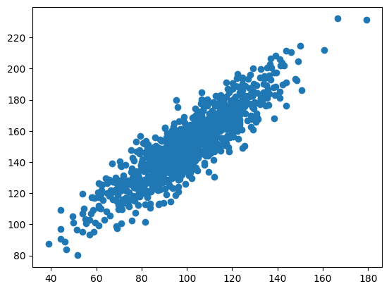
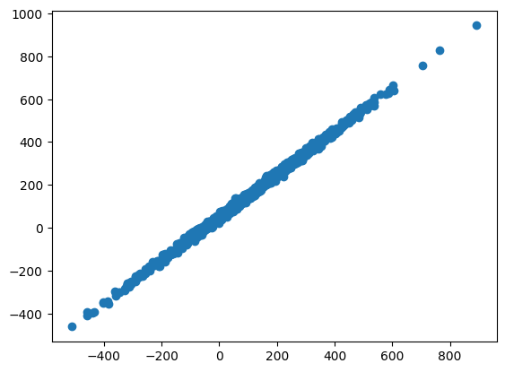
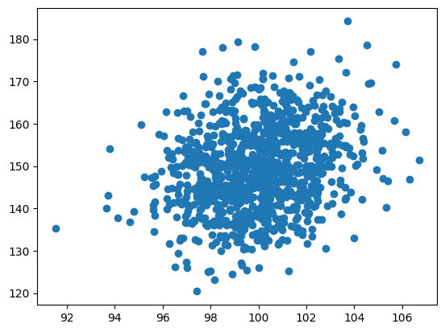
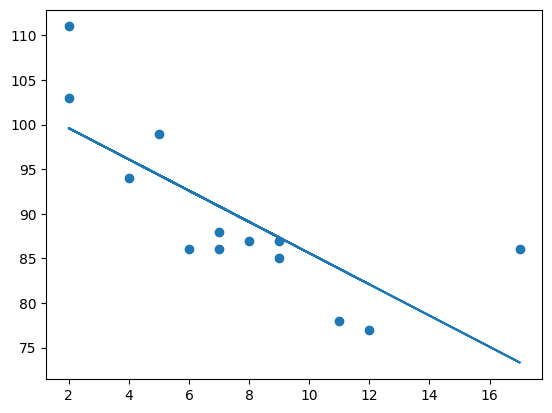
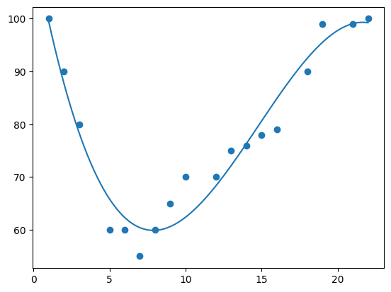
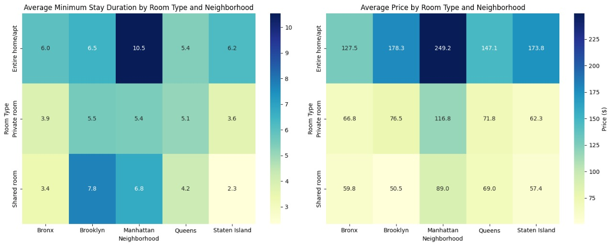

# Learning Outcomes
- Learn about the key paradigms and algorithms in machine learning.
- Get an understanding of data analytics based on machine learning and using modern programming tools, such as Python or R.
- Experience how machine learning and data analytics can be used in real-world applications.
- Acquire the ability to gather and synthesise information from multiple sources to aid in the systematic analysis of complex problems using machine learning tools and algorithms.

# 4th Industrial Revolution (Discussion Forum)
Coined by Klaus Schwab, the 4th Industrial Revolution represents a transformative era characterized by the widespread integration of artificial intelligence, the Internet of Things, robotics, and other cutting-edge technologies. This revolution is reshaping industries, economies, and societies, impacting not only production processes but also the nature of work, communication, and governance. Scholars analyze its implications for innovation, socio-economic structures, and global competitiveness, emphasizing the need for adaptive policies and educational frameworks to navigate this rapidly evolving landscape.

The **Fourth Industrial Revolution (4IR)** is a term used to describe the current era of technological change, which is characterized by the convergence of digital, physical, and biological technologies. It is also known as Industry 4.0, and is often seen as the next phase of the Industrial Revolution, following the mechanization of the 18th century, the mass production of the 20th century, and the use of electronics and information technology to automate production in the late 20th century.

The 4IR is being driven by a number of key technologies, including artificial intelligence (AI), robotics, the Internet of Things (IoT), 3D printing, and cloud computing. These technologies are enabling new products, services, and business models, and are transforming the way we live and work.

Our exploration of the impact of AI in the fourth industrial revolution, centered around the Boeing 737 Max incident, has yielded valuable insights. The economic and reputational costs incurred by Boeing due to the MCAS failure emphasize the need for a nuanced understanding of AI's capabilities, as highlighted by Nicholas referencing Chanda and Banerjee.

Tasweem’s introduction of IoT showcased its potential benefits and pitfalls in aviation safety, referencing Bauer et al. and Kaushik et al. This broadened our understanding of the implications of integrating IoT into aviation systems.

Giuseppe’s focus on the increasing frequency of AI incidents, as tracked by [incidentdatabase.ai](http://incidentdatabase.ai/), served as a stark reminder of the need for vigilance. The call for ethics and caution in AI deployment aligns with the growing responsibility we bear as technology evolves.

Ruminating on our course topics—Exploratory Data Analysis and Correlation/Regression—it becomes evident that a more robust application of these methodologies could have helped prevent issues like the Boeing 737 Max incident. Exploratory Data Analysis is pivotal in uncovering patterns and potential risks within data, while the application of Correlation and Regression aids in assessing the impact of various factors on system performance. Had these methodologies been applied rigorously, it might have flagged potential issues in the MCAS system, leading to proactive measures.

As we conclude, it's clear that AI integration in safety-critical industries demands a multi-faceted approach. Rigorous testing, clear communication, and continuous monitoring are crucial. The lessons from the Boeing incident underscore the need for ongoing learning and adaptation as technology evolves. In essence, our collective exploration has not only deepened our understanding of the challenges posed by AI but also emphasized our shared responsibility in navigating these challenges wisely and ethically.

[Link to the discussion forum](https://www.my-course.co.uk/mod/forum/discuss.php?d=177281)
[Summary post](https://www.my-course.co.uk/mod/forum/discuss.php?d=192418)

## References
Chanda, A., & Banerjee, T. (2021). The Boeing 737 MAX crisis: A case study in technology failure. *Business Horizons.*

Bauer, A., & Heesen, W. (2018). Internet of Things in aviation: Applications, challenges, and future directions. *Journal of Air Transportation Management*.

Kaushik, V., & Verma, S. (2019). Security and privacy challenges in the Internet of Things (IoT). *Journal of Systems and Software*.

Nicholas, J. (2019). The Boeing 737 MAX crisis: A cautionary tale for artificial intelligence. *MIT Sloan Management Review.*

Schwab, K. (2016). The Fourth Industrial Revolution. *World Economic Forum*.

# Correlation and Regression
Correlation is a measure of how much two things change together. For example, if we have data on the height and weight of people, we might find that taller people tend to weigh more. This means that height and weight are positively correlated.

Regression is a way to use the relationship between two things to predict one thing from the other. For example, we could use the regression model to predict a person's weight based on their height.

For these exercises we updated some scripts provided and changed variables as needed to observe how the change in data points impacts correlation and regression.

## Covariance Pearson Correlation

<div style="display: flex;">

<div style="flex: 50%; padding: 10px;">



</div>
<div style="flex: 50%; padding: 10px;">

- **data1**: mean=100.776 stdv=19.620
- **data2**: mean=151.050 stdv=22.358
- **Covariance**: 389.755
- **Pearsons correlation**: 0.888

</div>
</div>

By tweaking the values in the given script, we could observe the following that if the the number of data points is increased, the accuracy of the calculated mean, standard deviation, covariance, and correlation, would generally improve. With more data points, the calculations would better represent the underlying distribution and relationships between the variables.

In the example below, we changed the variables so data1 has 10 times more data points that the given by default. Which causes the plot to be denser and better represent the covariance of the data.

<div style="display: flex;">
<div style="flex: 50%; padding: 10px;">



</div>

<div style="flex: 50%; padding: 10px;">

- **data1**: mean=107.762 stdv=196.201  
- **data2**: mean=158.036 stdv=196.696  
- **Covariance**: 38577.514  
- **Pearson's correlation**: 0.999

</div>
</div>

On the other hand, when decreasing the amount of data points, the plot looks more sparse and wouldn’t represent the distribution of the data and correlation between the two variables. In the case of the calculated statistics value, their accuracy decrease and won’t be as reliable.

In the image below we have 10 times less datapoints than the one given by default.

<div style="display: flex;">
<div style="flex: 50%; padding: 10px;">



</div>
<div style="flex: 50%; padding: 10px;">

- **data1**: mean=99.987 stdv=2.020
- **data2**: mean=149.616 stdv=9.972
- **Covariance**: 4.834
- **Pearsons correlation**: 0.240 

</div>
</div>
In general, with a larger number of data points, the correlation calculation would be more reliable and closer to the true underlying relationship. With a smaller number of data points, the calculated correlation might be less representative and could vary more due to random fluctuations. The difference between each case is the strength of the tendency for the variables to vary together.

## Linear Regression
<div style="display: flex;">
<div style="flex: 50%; padding: 10px;">



</div>
<div style="flex: 50%; padding: 10px;">

As you change the value to predict the speed (the argument passed to myfunc), you are essentially trying to estimate the y-value on the regression line for a different x-value. This can be useful in making predictions based on the observed relationship between the variables. You can experiment with different x-values to see how the predicted y-values change, providing insights into the behavior of the linear regression model for this particular dataset.

</div>
</div>

The following table are shows the predictions in different times of the day:

|   X    | Predicted Value  |
|-------:|:----------------:|
|   6.0  |    92.598234     |
|  17.0  |   73.33406917    |
|   9.0  |   87.34437086    |
|   0.0  |   103.10596026   |
|   6.0  |    92.598234     |
|  11.0  |   83.84179544    |
|   6.0  |    92.598234     |
|   7.0  |   90.84694628    |
|  14.0  |    78.5879323    |
|   2.0  |   99.60338484    |


## Multiple Linear Regression
The coefficients of the linear regression model are the values that determine the relationship between the independent variables and the dependent variable. In this case, the coefficients are:

- **Weight coefficient**: 0.00755095
- **Volume coefficient**: 0.00780526

This means that for every **1kg** increase in weight, the CO2 emission is expected to increase by **0.00755095g**. For every **1cm3** increase in volume, the CO2 emission is expected to increase by **0.00780526g**.

If you change the values of the independent variables, the predicted CO2 emission will change accordingly. For example, if you change the weight from **2300kg** to **3300kg**, the predicted CO2 emission will increase from **107.2087328g** to **124.7182781g**.

This is because the linear regression model assumes that the relationship between the independent variables and the dependent variable is linear. In other words, the model assumes that the change in the dependent variable is directly proportional to the change in the independent variables.

The following table shows the predicted CO2 emissions for different combinations of weight and volume:

| Weight (kg) | Volume (cm3)  | Predicted CO2 emission (g)  |
|-------------|---------------|-----------------------------|
|    2300     |     1300      |         107.2087328         |
|    3300     |     1300      |        114.75968007         |
|    2300     |     1500      |         108.7697843         |
|    3300     |     1500      |        116.32073157         |
|    2000     |     1000      |        102.60187136         |

## Polynomial Regression
<div style="display: flex;">
<div style="flex: 50%; padding: 10px;">



</div>
<div style="flex: 50%; padding: 10px;">

The code uses polynomial regression to model the relationship between the time of day (represented by 'x') and the speed of cars passing a tollbooth (represented by 'y'). It visualizes the data with a scatter plot and a cubic polynomial curve. The R-squared score is then calculated to assess the goodness of fit of the model. 

</div>
</div>

The degree of the polynomial is an important parameter in polynomial regression. A higher degree polynomial will be able to fit more complex relationships between the independent and dependent variables. However, a higher degree polynomial is also more likely to overfit the data. Overfitting occurs when the model learns the training data too well and is unable to generalize to new data.

The following table are shows the predictions in different times of the day:

|   X    | Predicted Value  |
|-------:|:----------------:|
|   18.0 |    92.4867375    |
|   20.0 |   97.76768833    |
|   13.0 |   72.17820742    |
|   17.0 |    88.8733127    |
|   14.0 |   76.32434409    |
|   17.0 |    88.8733127    |
|   21.0 |   99.07136381    |
|   1.0  |   99.54274393    |
|   13.0 |   72.17820742    |
|   14.0 |   76.32434409    |

# Clustering
Clustering, a pivotal concept in machine learning, involves the categorization of data points into groups based on their inherent similarities. The ability to effectively cluster data is crucial for uncovering patterns, making predictions, and gaining valuable insights. One powerful tool in this endeavor is the Jaccard Coefficient, renowned for measuring the similarity between sets. Unlike traditional metrics, Jaccard excels in scenarios where the focus is on the intersection of elements rather than their absolute values, making it particularly well-suited for analyzing categorical data.

In this exercise, we harnessed the power of Jaccard Coefficient to analyze pathological test results for individuals named Jack, Mary, and Jim, we aimed to quantify the similarity between their health profiles. For this we need to also consider that there are values that are represented differently in the table but for our purposes, they are the same. Specifically A and N are equals, for our symmetric table, these will be both **0**. As for the Y and P values, these are both going to have the value of **1**.

**Original Table**:

| Name | Gender | Fever | Cough | Test-1 | Test-2 | Test-3 | Test-4 |
|------|--------|-------|-------|--------|--------|--------|--------|
| Jack |   M    |   Y   |   N   |   P    |   N    |   N    |   A    |
| Mary |   F    |   Y   |   N   |   P    |   A    |   P    |   N    |
| Jim  |   M    |   Y   |   P   |   N    |   N    |   N    |   A    |

**Symmetric Table**:

| Name | Gender | Fever | Cough | Test-1 | Test-2 | Test-3 | Test-4 |
|------|--------|-------|-------|--------|--------|--------|--------|
| Jack |   M    |   1   |   0   |   1    |   0    |   0    |   0    |
| Mary |   F    |   1   |   0   |   1    |   0    |   1    |   0    |
| Jim  |   M    |   1   |   1   |   0    |   0    |   0    |   0    |


The Jaccard coefficients for the three pairs are as follows:

- (Jack, Mary) = 0.6666666666666666
- (Jack, Jim) = 0.3333333333333333
- (Jim, Mary) = 0.25

These values were the result of running the following code to compute Jaccard's coefficient:

```

jack = set(['Fever', 'Test-1'])
mary = set(['Fever', 'Test-1', 'Test-3'])
jim = set(['Fever', 'Cough'])

def get_jaccard_coefficient(s1, s2):
  intersection = s1.intersection(s2)
  union = s1.union(s2)
  return len(intersection) / len(union)

jack_mary = get_jaccard_coefficient(jack, mary)
jack_jim = get_jaccard_coefficient(jack, jim)
jim_mary = get_jaccard_coefficient(jim, mary)

print("(Jack, Mary):", jack_mary)
print("(Jack, Jim):", jack_jim)
print("(Jim, Mary):", jim_mary)

```

## Clustering with Python (Group Project)
For this assignment we were a team of 3. This reports aimed to make an analysis of the **AB_NYC_2019** dataset, which contains a lot of information encompassing listing activities and metrics for the year 2019. The report should get key insights that will not only address a substantive issue for Airbnb but also pave the way for strategic decision-making. As we navigate through the tasks of posing a compelling business analytic question, conducting in-depth data analysis, and crafting a concise yet informative analytical report, the goal is to provide the executive board members of Airbnb with actionable intelligence derived from the nuances of the dataset.

This report aims to forecast Airbnb listing prices in New York City and identify the key factors that influence pricing. A comprehensive analytical approach was employed, merging quantitative and qualitative data analysis (DA). The key findings are as follows:

- Location, room type, availability, and minimum nights are the primary determinants of price.
- The duration a listing stays on the platform may also be relevant in determining pricing.
- A prediction accuracy of approximately 60% was achieved using a quantile pricing forecast model.
- Geographic price dispersion is evident, with desirable locations commanding higher prices, limited availability, and more reviews.
- Multivariate Regression with clustering is effective to assess variable effects on price but explains only a fraction of the variance.
- Non-linear models perform better, yet Generalised Linear Models (GLM) yield low coefficients, and Gaussian Distribution occasionally produces unlikely results.

Clustering was relevant in this report in two ways:

1. **Identifying geographical price dispersion**: Clustering was used to group Airbnb listings into clusters with similar price patterns. This revealed that there is significant geographical price dispersion, with desirable locations commanding higher prices, limited availability, and more reviews. This information can be used by Airbnb to develop more targeted pricing strategies and by hosts to make more informed decisions about their pricing.
2. **Assessing variable effects on price**: Clustering was also used to group Airbnb listings into clusters with similar characteristics. This allowed the researchers to assess the impact of different variables on price within each cluster. For example, they found that the impact of amenities on price varies depending on the location of the listing. This information can be used by Airbnb to develop more sophisticated pricing algorithms and by hosts to optimize their listings for specific markets.

In this assignment, one of the findings that I found interesting and suggested including in the report is correlating the average minimum stay duration by neighborhood group and then by room type. This could help answer the question of the average price per room type and neighborhood group, while also analyzing the average minimum days the rooms tend to have in these neighborhood groups.



**Recommendations**:
- Improve price predictability by augmenting the dataset with additional and diverse variables such as property size, amenities, and age.
- Once price predictability improves, multivariate models can forecast variable impacts in specific clusters, benefiting hosts with revenue-boosting recommendations and increasing Airbnb's commissions.
- Develop sophisticated analytical tools to offer real-time, data-driven pricing recommendations to hosts, thereby elevating both profitability and stakeholder satisfaction.

**Team Meetings**:
- **Team Structure and Meetings**: The team adopted a structured weekly meeting schedule to discuss the assignment's progress. Each team member initially took an individual approach, creating their own implementations and generating ideas for measurement.

- **Individual Contributions**: Team members took the initiative to independently work on the assignment, bringing diverse perspectives and ideas to the table.

- **Collaborative Discussions**: The weekly meetings facilitated collaborative discussions, allowing team members to share thoughts, ideas, and rationales behind specific measurements. This ensured a comprehensive understanding of the assignment and its relevance to Airbnb as a company.

- **Final Problem Definition**: Through collaborative discussions, the team collectively decided on the final problem to solve, honing in on the price study aspect.

- **Data Exploration**: The team engaged in hands-on data exploration, actively working with the dataset until meaningful insights emerged. This iterative process allowed for a deeper understanding of the data and the identification of useful findings.

The team maintained a productive pace throughout the meeting, which resulted in a fruitful outcome and a strong sense of synergy.

[Link to the peer report code](./clustering/peer_report_code.ipynb)

[Written Report](./clustering/group3_report.docx)

# Artificial Neural Networks (ANNs)
Artificial neural networks (ANNs) are a type of machine learning algorithm that are inspired by the structure and function of the human brain. ANNs are made up of interconnected nodes, called neurons, which process information and communicate with each other. ANNs can be trained to perform a wide variety of tasks, including image recognition, natural language processing, and machine translation.

In this unit, we worked on exercises where we simulated logical operators with perceptrons. Perceptrons are simple computational units that can be used to implement a variety of logical functions.

## Simple Perceptron
A perceptron is a simple type of artificial neuron that can be used to perform linear classification tasks. It takes a set of inputs and produces a single output, which is determined by a weighted sum of the inputs and a threshold function. This code implements a simple perceptron with two inputs and one output.

**How changes in the variables affect the outcomes**
The output of the perceptron will change as we experiment changing the values of the weights and the threshold.

- **Weights:** If we increase the value of a weight, then the output of the perceptron will be more sensitive to changes in the corresponding input.
- **Threshold:** If we increase the threshold value, then the output of the perceptron will be more likely to be 0.

### Examples

Here are some examples of how the output of the perceptron would change as the values of the weights and the threshold changes:

- **Example 1:** Let's say we have a perceptron with the following weights: `[0.5, 0.5]`
    
    This perceptron will be more sensitive to changes in both inputs equally. If we input the following values:
    
    `inputs = [4, 5]`
    
    The output of the perceptron will be `1`. This is because the weighted sum of the inputs is greater than or equal to the threshold value of `0`.
    
- **Example 2:** Now, let's say we increase the value of the first weight to **1** `[1, 0.5]`:
    
    This perceptron will now be more sensitive to changes in the first input. If we input the same values as before:
    
    `inputs = [4, 5]`
    
    The output of the perceptron will now be `1`.
    
    This is because the weighted sum of the inputs is now greater than or equal to the threshold value of 0, even though the second input has a lower weight.
    
- **Example 3:** Now, let's reduce the value of the first input to **2**:
    
    `inputs = [2, 5]`
    
    The weighted sum of the inputs is now less than the threshold value of **0**, even though the weights have not changed. Therefore, the output of the perceptron will now be **0**.
    

### Conclusion
Perceptrons are a simple but powerful tool for performing linear classification tasks. By adjusting the weights and the threshold, we can train a perceptron to perform a variety of tasks, such as classifying data points into two different categories or predicting whether a data point belongs to a particular class.

## Perceptron AND Operator
The provided Python code implements a simple perceptron, a fundamental unit in neural networks. The primary goal of the code is to train the perceptron to perform the logical **AND** operation on binary inputs. The perceptron is trained iteratively using a training loop, adjusting its weights based on the error in predictions until the total error becomes zero.

We could easily do the same for the other logical operators, such as an **OR** operator. We would only need to update the output variable to `[0, 1,  1,  1]`.

We could also update the `learning_rate` variable, this parameter controls how quickly the perceptron model updates its weights. A higher learning rate will cause the model to update its weights more quickly, while a lower learning rate will cause the model to update its weights more slowly.

If you increase the learning rate, the model will learn the training data more quickly. However, there is a risk that the model will overshoot the optimal solution, which can lead to poor performance on new data.

If you decrease the learning rate, the model will learn the training data more slowly. However, there is a risk that the model will get stuck in a local minimum, which can also lead to poor performance on new data.

## Multilayered Perceptron

**Multilayer perceptron (MLP)**, also known as a feedforward neural network, is a type of artificial neural network (ANN) that consists of a set of interconnected neurons organized in layers. Each neuron in a layer is connected to all of the neurons in the next layer, and the weights of these connections are what the network learns during training. MLP's are typically used for supervised learning tasks, such as classification and regression. MLP's are able to learn complex relationships between the input and output data, even if those relationships are non-linear. 

This code implements a simple feedforward neural network in Python. It takes input data and predicts an output. The neural network is trained using a process called backpropagation, which updates the weights of the neural network to minimize the error between the predicted output and the desired output.

**Updating variables**:
- `epochs`: Increasing the number of epochs allows the neural network to train more thoroughly, which can lead to better performance. However, it also increases the training time.
- `learning_rate`: Increasing the learning rate causes the neural network to update its weights more quickly, which can lead to faster training. However, it can also make the neural network more likely to overfit the training data.
- `weights_0`: Changing the weights of the input layer affects the way that the neural network processes the input data, which can lead to changes in performance.
- `weights_1`: Changing the weights of the output layer affects the way that the neural network produces its output, which can lead to changes in performance.

### References
McCulloch, W. S., & Pitts, W. (1943). A logical calculus of the ideas immanent in nervous activity. The Bulletin of Mathematical Biophysics, 5(4), 115-133.

Singh, J., & Banerjee, R. (2019). A study on single and multi-layer perceptron neural network. In 2019 3rd International Conference on Computing Methodologies and Communication (ICCMC)


## Gradient Cost Function
The Mayo, 2017 article discusses the use of gradient descent to train a linear regression model. Gradient descent is an algorithm that iteratively updates the parameters of a model to minimize the cost function. The cost function is a measure of how well the model fits the data.

The article also discusses the importance of choosing the right learning rate. The learning rate controls how big of a step to take in the direction of the gradient. If the learning rate is too high, the algorithm may overshoot the minimum of the cost function. If the learning rate is too low, the algorithm may take a long time to converge to the minimum.

Adjusting the iteration and learning rate values can have a significant impact on the performance of gradient descent.

- **Iterations**: More iterations give the algorithm more tries to find the best outcome. Yet, doing too many iterations can cause problems like overfitting or using too much computing power.

- **Learning Rate**: A higher learning rate means the algorithm takes bigger steps in figuring out the best values. This can make things faster, but if the rate is too high, the algorithm might miss the best result and not work well.

# Convolutional Neural Networks (CNN)
Convolutional neural networks, or CNNs, are a class of deep neural networks commonly used in image and video analysis. They're designed to automatically and adaptively learn spatial hierarchies of features from input data. The key innovation lies in their ability to capture local patterns through convolutional layers, making them particularly effective for tasks like image recognition and classification.

## Exercise
To see how Convolutional Neural Networks works we did an exercise where we use CNN to classify images from the CIFAR-10 dataset. These were the steps followed:

1. **Preprocessing**: The first step is to load and preprocess the data. This involves normalizing the images and converting the class labels to one-hot vectors. The pixel values of the images are normalized to the range [0, 1].

2. **Building the model**: The next step is to build the CNN model. The model consists of several convolutional layers, followed by max pooling layers and fully connected layers. The convolutional layers learn to extract features from the images, while the max pooling layers reduce the size of the feature maps. The fully connected layers learn to classify the feature maps into the different classes.

3. **Training the model**: The model is trained on the preprocessed dataset using the Adam optimizer and the categorical crossentropy loss function. Early stopping is implemented to stop training if there is no improvement in validation loss after a certain number of epochs.

4. **Evaluating the model**: Once the model is trained, it is evaluated on a held-out test set. The accuracy of the model is calculated as the percentage of images that are correctly classified. In this case, the model had an accuracy of around 66%.

**Prediction**

To make a prediction, the model is given an image as input. The model then extracts features from the image and classifies the feature maps into the different classes. The class with the highest probability is predicted to be the class of the image.

**Results**

To show the model in action, we iterated over the first **15** images in the test set to see what we would have as a result. Here is a table showing the predictions of the model for the first **15** images in the test set:

| index | Predicted Class | Actual Class |
| ---   | ---             | ---          |
| 0     | cat             | cat          |
| 1     | ship            | ship         |
| 2     | automobile      | ship         |
| 3     | airplane        | airplane     |
| 4     | deer            | frog         |
| 5     | frog            | frog         |
| 6     | cat             | automobile   |
| 7     | frog            | frog         |
| 8     | cat             | cat          |
| 9     | automobile      | automobile   |
| 10    | dog             | airplane     |
| 11    | truck           | truck        |
| 12    | cat             | dog          |
| 13    | horse           | horse        |
| 14    | truck           | truck        |


There are a couple of misclassifications, like predicting `automobile` instead of `ship` for **Image 2**, and predicting `cat` instead of `automobile` for **Image 6**. But overall, it's getting many of them right. These discrepancies could be due to the complexity of the dataset or the need for further tuning of the model. It might be worth experimenting with different architectures, hyperparameters, or increasing the dataset size to see if performance can be improved.

# Model Performance Measurement

Model performance measurement is the process of evaluating the performance of a machine learning model on a given task. It is important for machine learning and artificial neural networks because it allows us to:

- **Identify and fix problems with our models**: By evaluating the performance of our models, we can identify areas where they are not performing well and make changes to improve them.
- **Compare different models**: If we are considering using multiple models for a given task, we can use performance metrics to compare them and choose the model that performs the best.
- **Set expectations for our models**: By understanding the performance of our models, we can set realistic expectations for what they can and cannot do.

There are a variety of different performance metrics that can be used for machine learning and artificial neural networks. The specific metrics that are used will depend on the type of task and the type of model. For example, classification tasks typically use metrics such as accuracy, precision, recall, and F1 score. Regression tasks typically use metrics such as mean squared error (MSE), mean absolute error (MAE), and R-squared.

For this unit, the exercise is to used the script provided to calculate the performance of a machine learning model on a classification task using the following metrics: accuracy, precision, recall, and F1 score. Then we will change different parameters and observe its impact on AUC and R2 error.

## AUC

The AUC score is a measure of how well a classifier can distinguish between positive and negative cases. It is calculated by plotting the receiver operating characteristic (ROC) curve and calculating the area under the curve.

The following parameters have a significant impact on AUC:
- **Choice of classifier**: Some classifiers are better suited for certain types of data than others. For example, support vector machines (SVMs) are often used for high-dimensional data with a few features, while logistic regression is often used for lower-dimensional data with more features.
- **Hyperparameter tuning**: Hyperparameters are parameters that control the learning process of a classifier. For example, the regularization parameter in SVMs controls how much the model should penalize complexity. Hyperparameter tuning can be done manually or using a grid search or random search algorithm.
- **Feature selection**: Feature selection is the process of identifying and selecting the most important features for a given task. This can improve the performance of a classifier by reducing the amount of noise in the data.

## R2 error

The R2 error is a measure of how well a regression model explains the variation in the data. It is calculated by taking the one minus the proportion of the variance in the data that is unexplained by the model.

The following parameters have a significant impact on R2 error:
- **Choice of model**: Some regression models are better suited for certain types of data than others. For example, linear regression is often used for linear data, while polynomial regression is often used for non-linear data.
- **Hyperparameter tuning**: Hyperparameters are parameters that control the learning process of a regression model. For example, the learning rate in stochastic gradient descent controls how quickly the model updates its parameters. Hyperparameter tuning can be done manually or using a grid search or random search algorithm.
- **Data preprocessing**: Data preprocessing can improve the performance of a regression model by reducing the amount of noise in the data. For example, normalizing the data can improve the performance of models that are sensitive to the scale of the features.

## References
Panesar, A. (2020). Evaluating Machine Learning Models. Apress eBooks, pp.189–205. https://doi.org/10.1007/978-1-4842-6537-6_7

‌Ghosh, Samadrita. “The Ultimate Guide to Evaluation and Selection of Models in Machine Learning.” Neptune.ai, 21 July 2022, https://neptune.ai/blog/ml-model-evaluation-and-selection


# Legal and Ethical Views on ANN Applications (Discussion Forum)
As we explore the landscape of AI authors, the discussion focuses on the transformative potential and inherent risks in various fields. My first post highlighted the versatility of artificial neural network (ANN)-powered AI authors, from administrative tasks to creative endeavors, while acknowledging the risks of inaccuracies and biases. Referring to Hutson (2021) and other scholarly works, I emphasized the need for responsible use and careful content control.

Ruth's contribution moved the discussion into the educational space and highlighted the growing use of AI tools by students. Her insights shed light on concerns about academic integrity, legal issues surrounding intellectual property, and the broader impact on employment, citing the Hollywood writers' strike as a pertinent example.

Tasweem further added further depth to the discussion by delving into existential questions about AI-generated content, particularly its potential impact on human creativity and uniqueness. Based on references such as Hu (2020) and UNESCO (2021), the convergence of ideas underscores the need for a fine balance between the usefulness of AI authors and the preservation of authenticity, especially in educational settings. The digitization of education, as UNESCO (2021) points out, brings both potential benefits and cultural-ethical challenges that require a different approach.

When navigating the evolving landscape of AI authors, it is clear that constant dialogue and reflection are necessary. As we move forward, the lessons learned from this forum will lead to a thoughtful consideration of the risks and benefits of integrating AI in various professional and creative fields.

[Link to the discussion forum](https://www.my-course.co.uk/mod/forum/discuss.php?d=192423)

[Summary post](https://www.my-course.co.uk/mod/forum/discuss.php?d=193663)

## References

Hutson, M. (2021). Robo-writers. Nature, 590(7846).

Purington, A., Taft, J., Sannon, S., & Scheutz, M. (2017). "I know you didn't write that": Identifying and detecting machine-generated creative text. In Proceedings of the 2017 ACM Conference on Computer Supported Cooperative Work and Social Computing.

Brembs, B. (2020). Artificial intelligence in education: Promises and perils. Nature Reviews Education.

Hu, 2020. "Bias in Generative AI Models", AI Ethics Journal, vol. 12, no. 3, pp. 45-56.

UNESCO, 2021. The Digital Transformation of Education: An Overview, UNESCO Publishing, Paris.

Pedersen and Duin, 2022. "The Rise of AI Teachers in Modern Education", Educational Technology Review, vol. 29, no. 2, pp. 89-104.

Beckett, L. (May 26, 2023) ‘Those who hate AI are insecure’: inside Hollywood’s battle over artificial intelligence. The Guardian. Available from: https://www.theguardian.com/us-news/2023/may/26/hollywood-writers-strike-artificial-intelligence

Cotton, D., Cotton, P., Reuben Shipway, J. (2023) Chatting and cheating: Ensuring academic integrity in the era of ChatGPT Innovations in Teaching International. DOI: https://doi.org/10.1080/14703297.2023.2190148


# Final Submission (Group Project)
For this assignment we were a team of 3. This assignment focuses on building a neural network model for image recognition using the CIFAR-10 dataset. The CIFAR-10 dataset contains 60,000 images of 10 different object classes, and is a popular benchmark for evaluating object recognition algorithms.

In this report we discuss the key aspects of deep learning model development, including data preparation, model architecture, training paradigms, and evaluation metrics. We also reflect on the ethical implications of image recognition technology.

We began by preparing the CIFAR-10 dataset, normalizing the pixel values and augmenting the data to increase its diversity. Then, we designed and trained a convolutional neural network (CNN) model to classify the images. We used the Adam optimizer and early stopping to ensure that the model trained efficiently and avoided overfitting.

Something that I brought to the group was the idea of doubling the number of filters as the network goes deeper. This is a common practice in convolutional neural networks, as it allows the network to learn more complex features as it processes the inputs. Additionally, it can help to reduce overfitting, as it forces the network to rely on more abstract features.

Our model achieved an overall accuracy of around 90% on the CIFAR-10 dataset, with some classes, such as "Ship" and "Automobile", performing particularly well. However, we also identified some areas where the model could be improved, such as its recall score for the "Cat" class.

We gained valuable insights from our exploration of deep learning with CIFAR-10. We learned that data preprocessing is essential for image classification tasks, and that CNNs are a powerful tool for this task. We also learned about the importance of balancing precision and recall, and the need to carefully select optimization methods and training paradigms.

**Team Meetings**:
- **Team Structure and Meetings**: The team maintained the weekly meeting schedule from the previous project to discuss the assignment's progress.

- **Individual Contributions**: We adopted the same approach as last time, where each team member generated an initial simple solution to the problem at hand. This method allowed everyone to engage with the subject, become comfortable with Python implementation, and brainstorm interesting ideas for us to explore.

- **Collaborative Discussions**: Weekly, we conducted reviews of individual work, identifying the most accurate models and sharing strategies. Discussions on next steps were documented to facilitate the synthesis of our findings.

- **Final Problem Definition**: We established a final deadline for completing our solution, enabling us to compile all documentation and prepare for the presentation.

- **Team Presentation**: Topics for the final presentation video were assigned, and each team member prepared their segment. We scheduled a recording day to ensure everyone felt confident and satisfied with their presentation.


[Link to transcript](./ann/Team_Presentation_Group_3_Transcript.pdf)

[Link to solution code](./ann/Team_Presentation_Group_3_Code.ipynb)

# Reflection
This module was really eye-opening for me. I had a general idea of what machine learning is and how it was being used, but this module helped me understand more in depth not just what machine learning is, but also how it is implemented and how everything works on the back end in some of the most popular paradigms and algorithms.

I found the concept of the 4th Industrial Revolution to be really interesting and intriguing. The concerns behind human privacy and safety are topics that are always top of mind for me, which is why I decided to talk about the Boeing 737 Max incident and its MCAS failure. Improperly regulated automated systems can cause devastating and irreparable issues like human losses. This is why this topic is so important to me personally.

Some concepts such as correlation, regression, and clustering were familiar from the past module of Numerical Analysis, but others such as the Jaccard Coefficient were new. This meant that I needed to spend more time on them, especially in the cases of symmetric values, where the table must be converted accordingly. In the end, the easiest way to understand this was to code the implementation of a function that computes the Jaccard Coefficient.

In our first team project, we had to come up with an interesting report that would help Airbnb make interesting business decisions based on their 2019 listings dataset. Each person in the team tried to find interesting ideas, and by listening to their findings in our team meetings, I also learned new ways of poking the data to get something useful back. This made the experience really pleasant for the most part. In the end, we decided on the idea we liked the most and focused on getting the most data we could around it.

Right after that, we started right away on our next assignment, which was the final project based on Artificial Neural Networks, which was the main topic of the second half of the module. Concepts like Perceptrons and Convolutional Neural Networks were particularly interesting to me, especially the fact that this Machine Learning approach is inspired by how biological brains work. Being able to play with image processing and image recognition was also fun. The team applied the same approach as last time and we met weekly to discuss what each of us had found out and whether the model was getting more accurate at identifying images and why. A topic that was quite challenging for me was the Model Performance Measurement topic. I understand that it is important to be able to objectively know what model to pick based on data, but the way it is decided based on the AUC and the R2 Errors is still a little bit unclear to me. This is a topic that I want to read more about on my own time.

Overall, I enjoyed this module a lot. It encapsulates what I want to learn during this course, and being able to have first-hand experiences in real-life-like projects makes the journey more interesting and engaging. I was provided with valuable opportunities to learn new skills and grow my machine learning skills exponentially. It has allowed me to learn new aspects of Artificial Intelligence and how to work effectively with a team. The skills I’ve gotten from this module are set to be helpful in real-world scenarios. In future modules, I plan to apply the learnings from this course to avoid making the same mistakes and learn more quickly. I am looking forward to what’s to come in the next modules.